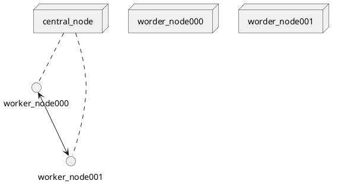

# example_plant_uml
Just an example to see how plant UML might be used in a README to explain something

## Some header

In this repo we implement the `central_node` as shown here .. the `worker_node`s are implement in another repo.

